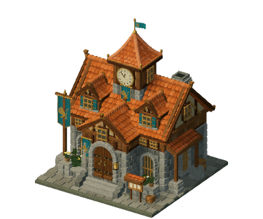

# The Free Game

**Lucas Marques, from Shiva**

一款开放的中世纪村庄建造游戏。规划道路与建筑，培养工人，
看着村庄自主运转。使用 Godot 4.7.2 和 GDScript 制作。

[在浏览器中游玩](https://vale-dos-vinhedos.lucas579686.chatgpt.site/) ·
[English](README.md) · [Português](README.pt-BR.md) · [Contribute](CONTRIBUTING.md) · [Architecture](docs/ARCHITECTURE.md)



## 在编辑器中开始

1. 用 **Code → Download ZIP** 下载本仓库，或 fork 后克隆。
2. 从
   [官方发布页](https://github.com/godotengine/godot-builds/releases/tag/4.7.2-stable)
   安装 **Godot 4.7.2 标准编辑器**。不需要 .NET 版本。
3. 在 Godot 中选择 **Import**，选中 `game/project.godot` 并打开。
4. 等待首次资源导入，然后在 `scenes/approved.tscn` 上按 **F6**，
   或按 **F5** 运行主场景。

源码包含游戏、运行时纹理与网格、原始概念图、测试以及浏览器导出工具。
本地开发或游玩不需要账号、API 密钥、付费服务或图像生成服务。

## 命令

可选的命令行流程需要 Python 3.10+ 以及同一套 Godot 编辑器。
若 `python` 不可用，macOS/Linux 请用 `python3`，Windows 可用 `py`。

```sh
python tools/dev.py doctor
python tools/dev.py run
python tools/dev.py test
python tools/dev.py export-web
python tools/dev.py serve --port 8000
```

若 Godot 不在 PATH 中，可在任意引擎命令后加上 `--godot "/path/to/Godot"`，
或把 `GODOT_BIN` 设为可执行文件。macOS 的 `.app` 路径也可以。
要做浏览器导出，请先在 Godot 的 **Editor → Manage Export Templates**
安装 **4.7.2 导出模板**。

导出命令会创建一份临时的 Compatibility 渲染器副本，保留桌面项目的渲染器。
输出在 `builds/web/`。运行 `serve` 后打开 `http://127.0.0.1:8000/`；
不要把 HTML 当本地文件直接打开。
要发布自己的版本，请把 `builds/web/` 里的**全部文件**上传到支持导出体积的
静态 HTTPS 主机。见 [网页发布](docs/WEB.md)。

## 目前可玩的内容

这是桌面浏览器测试版，不是完整的商业发行。开局有主楼、教师学校、
广场和村民。你可以铺路、放置建筑、培养职业并扩展经济。

- 平民会自动接任务，空闲时聚在广场。
- 搬运工运送材料；建筑工建造房屋和道路格子。
- 每座建筑都需要木材和石料。
- 菜园会可见地生长，食物会被收获并运送。
- 经济链包含葡萄园和酿酒坊。
- 点击学校会打开培养面板。
- 手动存档和自动存档都保存在当前浏览器/设备本地。

本测试版没有军队、多人、云存档或服务器经济。
移动端操作和性能仍需专门打磨。概念图里有后续版本的想法；
那并不代表图中功能都已实现。

## 目录导览

| 文件夹 | 内容 |
| --- | --- |
| `game/` | 完整可编辑的 Godot 项目 |
| `game/simulation/` | 平民自主行为、道路、建造、生产、存档 |
| `game/presentation/` | 3D 场景、地形、人物、程序化建筑模型 |
| `game/ui/` | HUD、培养、建造菜单、玩家反馈 |
| `game/assets/` | 运行时图像、纹理、网格资源、着色器、预览图 |
| `game/tests/` | 模拟检查与开发渲染工具 |
| `art/` | 原画、概念图、视觉规格和提示词 |
| `tools/` | 可移植的开发命令和浏览器加载页 |
| `docs/` | 架构、自定义与发布指南 |

## 复用与署名

**代码、工具和文档：MIT。原画：CC BY 4.0。**
可在这些许可下修改、分发并商业使用。
代码需保留 MIT 声明。原画请署名
**Lucas Marques, from Shiva**，链接 CC BY 4.0，并标明修改。

见 [LICENSE](LICENSE)、[LICENSE-ASSETS.md](LICENSE-ASSETS.md) 和
[THIRD_PARTY_NOTICES.md](THIRD_PARTY_NOTICES.md)。引擎/依赖声明仍保留各自
要求的署名。部分原画由 AI 生成，作为可编辑的项目材料和设计参考收录。

建议的原画署名为：
> Original artwork: Lucas Marques, from Shiva — The Free Game.
> CC BY 4.0. Changes: [describe your changes, if any].

[Browse the original art catalog / Abrir o catálogo de artes](art/catalogo-visual-v1/catalogo.html) — 下载仓库后在本地打开此 HTML。
